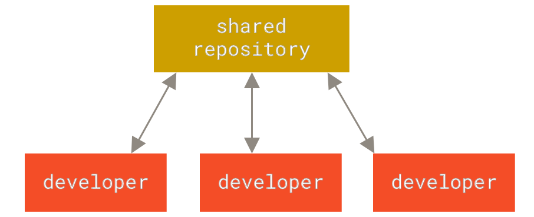
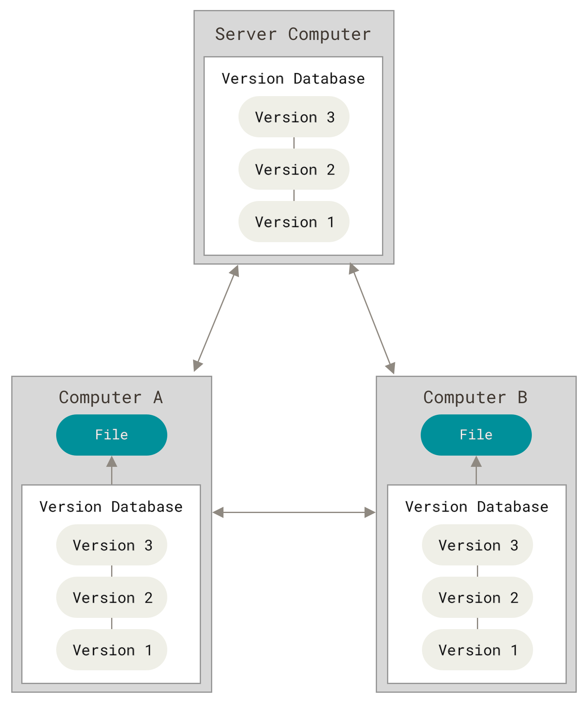
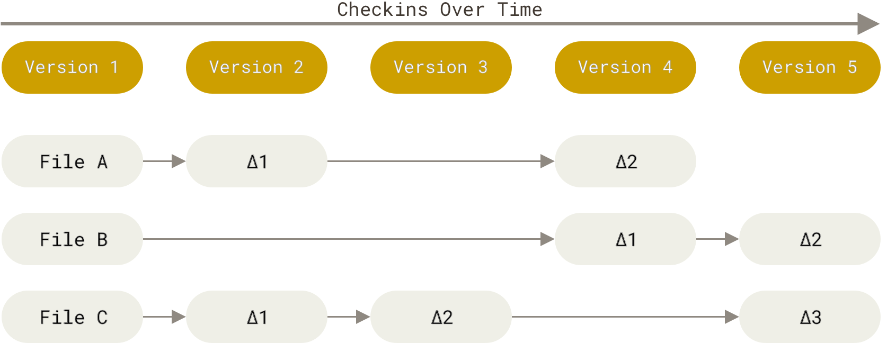
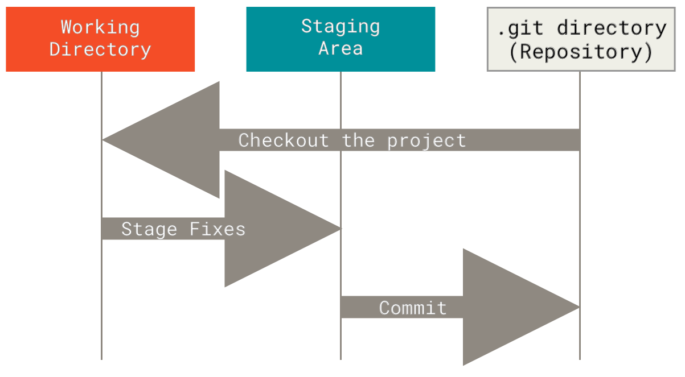

# Chapter 1 **Getting Started**

## **关于版本控制**

> 版本控制是一种记录一个或若干文件内容变化，以便将来查阅特定版本修订情况的系统。

### **本地版本控制系统**

许多人习惯用复制整个项目目录的方式来保存不同的版本，或许还会改名加上备份时间以示区别。 

为了解决这个问题，人们很久以前就开发了许多种本地版本控制系统，大多都是采用某种简单的数据库来记录文件的历次更新差异。其中最流行的一种叫做 RCS， RCS 的工作原理是在硬盘上保存补丁集（补丁是指文件修订前后的变化）；通过应用所有的补丁，可以重新计算出各个版本的文件内容。


图1：本地版本控制

### **集中化的版本控制系统**

接下来人们又遇到一个问题，如何让在不同系统上的开发者协同工作？ 于是，集中化的版本控制系统（Centralized Version Control Systems，简称 CVCS）应运而生。 这类系统，都有一个单一的集中管理的服务器，保存所有文件的修订版本，而协同工作的人们都通过客户端 连到这台服务器，取出最新的文件或者提交更新。 



图2：集中化的版本控制

好处：

- 每个人都可以在一定程度上看到项目中的其他人正在做些什么
- 管理员也可以轻松掌控每个开发者的权限，并且管理一个 CVCS 要远比在各个客户端 

上维护本地数据库来得轻松容易

坏处：

如果中央服务器宕机一小时，那么在这一小时内，谁都无法提交更新，也就无法协同工作。 如果中心数据库所在的磁盘发生损坏，又没有做恰当备份，毫无 疑问你将丢失所有数据——包括项目的整个变更历史，只剩下人们在各自机器上保留的单独快照。 本地版本控制系统也存在类似问题，只要整个项目的历史记录被保存在单一位置，就有丢失所有历史更新记录的风险。

### **分布式版本控制系统**

于是分布式版本控制系统（Distributed Version Control System，简称 DVCS）面世了。 在这类系统中，像Git等，客户端并不只提取最新版本的文件快照， 而是把代码仓库完整地镜像下来，包括完整的历史记录。 这么一来，任何一处协同工作用的服务器发生故障，事后都可以用任何一个镜像出来的本地仓库恢复。 因为每一次的克隆操作，实际上都是一次对代码仓库的完整备份。



图3：分布式版本控制

许多这类系统都可以指定和若干不同的远端代码仓库进行交互。籍此，你就可以在同一个项目中，分别和不同工作小组的人相互协作。 你可以根据需要设定不同的协作流程，比如层次模型式的工作流，而这在以前的集中式系统中是无法实现的。

## **Git** **简史**

Linux 内核开源项目有着为数众多的参与者。 绝大多数的 Linux 内核维护工作都花在了提交补丁和保存归档的繁琐事务上（1991－2002年间）。 到 2002 年，整个项目组开始启用一个专有的分布式版本控制系统BitKeeper 来管理和维护代码。到了 2005 年，开发 BitKeeper 的商业公司同 Linux 内核开源社区的合作关系结束，他们收回了 Linux 内核社区免费使用 BitKeeper 的权力。 这就迫使 Linux 开源社区（特别是 Linux 的缔造者 Linus Torvalds）基于使用BitKeeper 时的经验教训，开发出自己的版本系统。 他们对新的系统制订了若干目标： 

• 速度

• 简单的设计

• 对非线性开发模式的强力支持（允许成千上万个并行开发的分支）

• 完全分布式 

• 有能力高效管理类似 Linux 内核一样的超大规模项目（速度和数据量） 

自诞生于 2005 年以来，Git 日臻成熟完善，在高度易用的同时，仍然保留着初期设定的目标。 它的速度飞快，极其适合管理大项目，有着令人难以置信的非线性分支管理系统（参见 Git 分支）。

## **Git** **是什么？**

请注意接下来的内容非常重要，若你理解了 Git 的思想和基本工作原理，用起来就会知其所以然，游刃有余。

### **直接记录快照，而非差异比较**

Git 和其它版本控制系统（包括 Subversion 和近似工具）的主要差别在于 Git 对待数据的方式。 从概念上来说，其它大部分系统以文件变更列表的方式存储信息，这类系统（CVS、Subversion、Perforce、Bazaar 等 等） 将它们存储的信息看作是一组基本文件和每个文件随时间逐步累积的差异 （它们通常称作 **基于差异（delta-based）的版本控制）。



图4 存储每个文件与初始版本的差异

Git 不按照以上方式对待或保存数据。反之，Git 更像是把数据看作是对小型文件系统的一系列快照。 在 Git中，每当你提交更新或保存项目状态时，它基本上就会对当时的全部文件创建一个快照并保存这个快照的索引。为了效率，如果文件没有修改，Git 不再重新存储该文件，而是只保留一个链接指向之前存储的文件。 Git 对待 数据更像是一个 **快照流**。


图 5. 存储项目随时间改变的快照.

这是 Git 与几乎所有其它版本控制系统的重要区别。Git 更像是一个小型的文件系统，提供了许多以此为基础构建的超强工具，而不只是一个简单的 VCS。稍后我们在Git 分支讨论 Git 分支管理时，将探究这种方式对待数据所能获得的益处。

### **近乎所有操作都是本地执行**

在 Git 中的绝大多数操作都只需要访问本地文件和资源，一般不需要来自网络上其它计算机的信息。 因为你在本地磁盘上就有项目的完整历史，所以大部分操作看起来瞬间完成。 

### **Git** **保证完整性**

Git 中所有的数据在存储前都计算校验和，然后以校验和来引用。 这意味着不可能在 Git 不知情时更改任何文件内容或目录内容。 这个功能建构在 Git 底层，是构成 Git 哲学不可或缺的部分。 若你在传送过程中丢失信息或损 坏文件，Git 就能发现。Git 用以计算校验和的机制叫做 SHA-1 散列（hash，哈希）。 这是一个由 40 个十六进制字符（0-9 和 a-f）组成的字符串，基于 Git 中文件的内容或目录结构计算出来。 SHA-1 哈希看起来是这样：

```
24b9da6552252987aa493b52f8696cd6d3b00373
```

Git 中使用这种哈希值的情况很多，你将经常看到这种哈希值。 实际上，Git 数据库中保存的信息都是以文件内容的哈希值来索引，而不是文件名。

### **Git** **一般只添加数据**

你执行的 Git 操作，几乎只往 Git 数据库中 **添加** 数据。 你很难使用 Git 从数据库中删除数据，也就是说 Git 几乎不会执行任何可能导致文件不可恢复的操作。 同别的 VCS 一样，未提交更新时有可能丢失或弄乱修改的内容。但是一旦你提交快照到 Git 中， 就难以再丢失数据，特别是如果你定期的推送数据库到其它仓库的话。这使得我们使用 Git 成为一个安心愉悦的过程，因为我们深知可以尽情做各种尝试，而没有把事情弄糟的危险。 更深度探讨 Git 如何保存数据及恢复丢失数据的话题，请参考撤消操作。

### **三种状态**

现在请注意，如果你希望后面的学习更顺利，请记住下面这些关于 Git 的概念。 Git 有三种状态，你的文件可能处于其中之一： **已提交（committed）**、**已修改（modified）** 和 **已暂存（staged**）。 

• 已修改表示修改了文件，但还没保存到数据库中。

• 已暂存表示对一个已修改文件的当前版本做了标记，使之包含在下次提交的快照中。

• 已提交表示数据已经安全地保存在本地数据库中。

这会让我们的 Git 项目拥有三个阶段：工作区、暂存区以及 Git 目录。




图 6. 工作目录、暂存区域以及 Git 仓库

工作区是对项目的某个版本独立提取出来的内容。 这些从 Git 仓库的压缩数据库中提取出来的文件，放在磁盘上供你使用或修改。

暂存区是一个文件，保存了下次将要提交的文件列表信息，一般在 Git 仓库目录中。 按照 Git 的术语叫做“索 引”，不过一般说法还是叫“暂存区”。

Git 仓库目录是 Git 用来保存项目的元数据和对象数据库的地方。 这是 Git 中最重要的部分，从其它计算机克隆仓库时，复制的就是这里的数据

基本的 Git 工作流程如下：

1. 在工作区中修改文件。

2. 将你想要下次提交的更改选择性地暂存，这样只会将更改的部分添加到暂存区。

3. 提交更新，找到暂存区的文件，将快照永久性存储到 Git 目录。 

如果 Git 目录中保存着特定版本的文件，就属于 **已提交** 状态。 如果文件已修改并放入暂存区，就属于 **已暂存** 状 态。 如果自上次检出后，作了修改但还没有放到暂存区域，就是 **已修改** 状态。 在 Git 基础 一章，你会进一步了解这些状态的细节， 并学会如何根据文件状态实施后续操作，以及怎样跳过暂存直接提交。


## **命令行**

## **安装** **Git**

## **初次运行** **Git** **前的配置**

## **获取帮助**

## **总结**