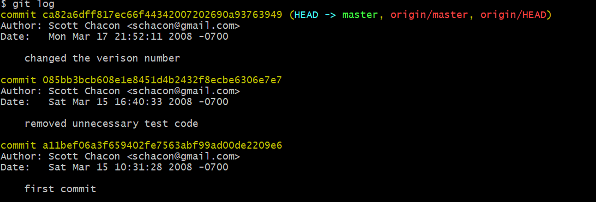

> 孤勇，主要从事统计遗传学的研究工作！

# Chapter 2 **Git Basics**

本章涵盖了你在使用 Git 完成各种工作时将会用到的各种基本命令。 在学习完本章之后，你应该能够配置并初始化一个仓库（repository）、开始或停止跟踪（track）文件、暂存（stage）或提交（commit）更改。 本章也将向你演示了如何配置 Git 来忽略指定的文件和文件模式、如何迅速而简单地撤销错误操作、如何浏览你的项目的历史版本以及不同提交（commits）之间的差异、如何向你的远程仓库推送（push）以及如何从你的远程仓库拉取（pull）文件。

## **获取** **Git** **仓库**

**获取** **Git** **仓库**

通常有两种获取 Git 项目仓库的方式：

1. 将尚未进行版本控制的本地目录转换为 Git 仓库；git init 

2. 从其它服务器 **克隆** 一个已存在的 Git 仓库。 git clone 

两种方式都会在你的本地机器上得到一个工作就绪的 Git 仓库。如果你想在克隆远程仓库的时候，自定义本地仓库的名字，你可以通过额外的参数指定新的目录名：

> $ git clone https://github.com/libgit2/libgit2 mylibgit

## **记录每次更新到仓库**

工作目录下的每一个文件都不外乎这两种状态：**已跟踪** 或 **未跟踪**。简而言之，已跟踪的文件就是 Git 已经知道的文件。工作目录中除已跟踪文件外的其它所有文件都属于未跟踪文件，它们既不存在于上次快照的记录中，也没有被放 入暂存区。

 初次克隆某个仓库的时候，工作目录中的所有文件都属于已跟踪文件，并处于未修改状态，因为 Git刚刚检出了它们， 而你尚未编辑过它们。编辑过某些文件之后，由于自上次提交后你对它们做了修改，Git 将它们标记为已修改文件。 在工作时，你可以选择性地将这些修改过的文件放入暂存区，然后提交所有已暂存的修改，如此反复。


图9. 文件的状态变化周期

### **检查当前文件状态**


untracked files:表示Git 在之前的快照（提交）中没有这些文件；Git 不会自动将之纳入跟踪范围，除非你明明白白地告诉它“我需要跟踪该文 件”。 这样的处理让你不必担心将生成的二进制文件或其它不想被跟踪的文件包含进来。 不过现在的例子中，我们确实想要跟踪管理 README 这个文件。

not staged:表示git在之前的快照中（提交）有这些文件，但这些文件被修改过了！

### **跟踪新文件**

 git add README

### **暂存已修改的文件**

git add **,

如果git add之后，没有commit又修改，就会出现unstaged的信息

### **状态简览**

git status 命令的输出十分详细，但其用语有些繁琐。 Git 有一个选项可以帮你缩短状态命令的输出，这样可以以简洁的方式查看更改。 如果你使用 git status -s 命令或 git status --short 命令，你将得到一种 格式更为紧凑的输出。


新添加的未跟踪文件前面有 ?? 标记，新添加到暂存区中的文件前面有 A 标记，修改过的文件前面有 M 标记。 输出中有两栏，左栏指明了暂存区的状态，右栏指明了工作区的状态。例如，上面的状态报告显示： README 文件在工作区已修改但尚未暂存，而 lib/simplegit.rb 文件已修改且已暂存。 Rakefile 文件已修改，暂存后 又作了修改，因此该文件的修改中既有已暂存的部分，又有未暂存的部分。

### **忽略文件**

一般我们总会有些文件无需纳入 Git 的管理，也不希望它们总出现在未跟踪文件列表。 通常都是些自动生成的文 件，比如日志文件，或者编译过程中创建的临时文件等。 在这种情况下，我们可以创建一个名为 .gitignore的文件，列出要忽略的文件的模式。

文件 .gitignore 的格式规范如下： 

• 所有空行或者以 # 开头的行都会被 Git 忽略。 

• 可以使用标准的 glob 模式匹配，它会递归地应用在整个工作区中。

• 匹配模式可以以（/）开头防止递归。 

• 匹配模式可以以（/）结尾指定目录。 

• 要忽略指定模式以外的文件或目录，可以在模式前加上叹号（!）取反。

> 所谓的 glob 模式是指 shell 所使用的简化了的正则表达式。 星号（*）匹配零个或多个任意字符；[abc] 匹配任何一个列在方括号中的字符 （这个例子要么匹配一个 a，要么匹配一个 b，要么匹配一个 c）； 问号（?）只匹配一个任意字符；如果在方括号中使用短划线分隔两个字符， 表示所有在这两个字符范围内的都可以匹配 （比如 [0-9] 表示匹配所有 0 到 9 的数字）。 使用两个星号（`**`）表示匹配任意中间目录，比如 a/**/z 可以匹配 a/z 、 a/b/z 或 a/b/c/z 等。 

例如：

```
# 忽略所有的 .a 文件
*.a
# 但跟踪所有的 lib.a，即便你在前面忽略了 .a 文件
!lib.a
# 只忽略当前目录下的 TODO 文件，而不忽略 subdir/TODO
/TODO
# 忽略任何目录下名为 build 的文件夹
build/
# 忽略 doc/notes.txt，但不忽略 doc/server/arch.txt
doc/*.txt
# 忽略 doc/ 目录及其所有子目录下的 .pdf 文件
doc/**/*.pdf
```

更多信息可参见：https://github.com/github/gitignore 

> 可有多个.gitignore ，更多详情见 man gitignore

### **查看已暂存和未暂存的修改**

当前做的哪些更新尚未暂存？ 有哪些更新已暂存并准备好下次提交？ 虽然 git status 已经通过在相应栏下列出文件名的方式回答了这个问题，但 git diff 能通过文件补丁的格式更加具体地显示哪些行发生了改变。

- 查看尚未暂存的文件更新了哪些部分，不加参数直接输入 git diff，此命令比较的是工作目录中当前文件和暂存区域快照之间的差异。 也就是修改之后还没有暂存起来的变化内容
- 若要查看已暂存的将要添加到下次提交里的内容，可以用 git diff --staged 命令。 这条命令将比对已暂存文件与最后一次提交的文件差异： git diff --cached 查看已经暂存起来的变化（ --staged 和 --cached 是同义词）：

可以使用 git difftool 命令来调用 emerge 或 vimdiff 等软件（包括商业软件）输出 diff 的分析结果。 使用 git difftool --tool-help 命令来看你的系统

支持哪些 Git Diff 插件。

### **提交更新**

 在此之前，请务必确认还有什么已修改或新建的文件还没有 git add 过， 否则提交的时候不会记录这些尚未暂存的变化。 这些已修改但未暂存的文件只会保留在本地磁盘。 所以，每次准备提交前，先用 git status 看下，你所需要的文件是不是都已暂存起来了， 然后再运行提交命令 git commit：此时，会启动文本编辑器，让你输入提交信息。

另外，你也可以在 commit 命令后添加 -m 选项，将提交信息与命令放在同一行。

提交后它会告诉你，当前是在哪个分支（master）提交的，本次提交的完整 SHA-1 校验和是什么（463dc4f），以及在本次提交中，有多少文件修订过，多少行添加和删改过。

请记住，提交时记录的是放在暂存区域的快照。 任何还未暂存文件的仍然保持已修改状态，可以在下次提交时 纳入版本管理。 每一次运行提交操作，都是对你项目作一次快照，以后可以回到这个状态，或者进行比较。

### **跳过使用暂存区域**

git commit 加上 -a 选项，Git 就会自动把所有已经跟踪过的文件暂存起来一并提交，从而跳过 git add 步骤：` git commit -a -m 'added new benchmarks'`

这很方便，但是要小心，有时这个选项会将不需要的文件添加到提交中。

### **移除文件**

- 要从 Git 中移除某个文件，就必须要从已跟踪文件清单中移除（确切地说，是从暂存区域移除），然后提交。可以用 git rm 命令完成此项工作，并连带从工作目录中删除指定的文件，这样以后就不会出现在未跟踪文件清单中了。

-  如果要删除之前修改过或已经放到暂存区的文件，则必须使用强制删除选项 -f（译注：即 force 的首字母）。 这是一种安全特性，用于防止误删尚未添加到快照的数据，这样的数据不能被 Git 恢复。 

- 你想让文件保留在磁盘，但是并不想让 Git 继续跟踪。 当你忘记添加 .gitignore 文件，不小

心把一个很大的日志文件或一堆 .a 这样的编译生成文件添加到暂存区时，这一做法尤其有用。 为达到这一目的，使用 --cached 选项

- git rm 命令后面可以列出文件或者目录的名字，也可以使用 glob 模式。比如：

`$ git rm log/\*.log`

注意到星号 * 之前的反斜杠 \， 因为 Git 有它自己的文件模式扩展匹配方式，所以我们不用 shell 来帮忙展开。

此命令删除 log/ 目录下扩展名为 .log 的所有文件。 类似的比如：

`$ git rm \*~`

该命令会删除所有名字以 ~ 结尾的文件。

### **移动文件**

其实，运行 git mv 就相当于运行了下面三条命令：

```
$ mv README.md README
$ git rm README.md
$ git add README
```

如此分开操作，Git 也会意识到这是一次重命名，所以不管何种方式结果都一样。 两者唯一的区别在于，`git mv `是一条命令而非三条命令，直接使用 git mv 方便得多。 不过在使用其他工具重命名文件时，记得在提交前git rm 删除旧文件名，再 git add 添加新文件名。

## **查看提交历史**

不传入任何参数的默认情况下，git log 会按时间先后顺序列出所有的提交，最近的更新排在最上面。 正如你 所看到的，这个命令会列出每个提交的 SHA-1 校验和、作者的名字和电子邮件地址、提交时间以及提交说明。



-  -p 或 --patch ，它会显示每次提交所引入的差异（按 **补丁** 的格式输出）。 你也可以限制显示的日志条目数量，例如使用 -2 选项来只显示最近的两次提交。该选项除了显示基本信息之外，还附带了每次提交的变化。 当进行代码审查，或者快速浏览某个搭档的提交所带来的变化的时候，这个参数就非常有用了。

- 简略统计信息，可以使用 --stat 选项：--stat 选项在每次提交的下面列出所有被修改过的文件、有多少文件被修改了以及被修改过的文件的哪些行被移除或是添加了。 在每次提交的最后还有一个总结。 

- 另一个非常有用的选项是 --pretty。 这个选项可以使用不同于默认格式的方式展示提交历史。 这个选项有一些内建的子选项供你使用。 比如 oneline 会将每个提交放在一行显示，在浏览大量的提交时非常有用。 另外还有 short，full 和 fuller 选项，它们展示信息的格式基本一致，但是详尽程度不一：

  git log --pretty=format 常用的选项 列出了 format 接受的常用格式占位符的写法及其代表的意义。 

  `git log --pretty=format:"%h - %an, %ar : %s"`

  | **选项** | **说明**                                      |
  | -------- | --------------------------------------------- |
  | %H       | 提交的完整哈希值                              |
  | %h       | 提交的简写哈希值                              |
  | %T       | 树的完整哈希值\|                              |
  | %t       | 树的简写哈希值                                |
  | %P       | 父提交的完整哈希值                            |
  | %p       | 父提交的简写哈希值                            |
  | %an      | 作者名字                                      |
  | %ae      | 作者的电子邮件地址                            |
  | %ad      | 作者修订日期（可以用 --date=选项 来定制格式） |
  | %ar      | 作者修订日期，按多久以前的方式显示            |
  | %cn      | 提交者的名字                                  |
  | %ce      | 提交者的电子邮件地址                          |
  | %cd      | 提交日期                                      |
  | %cr      | 提交日期（距今多长时间）                      |
  | %s       | 提交说明                                      |

- 当 oneline 或 format 与另一个 log 选项 --graph 结合使用时尤其有用。 这个选项添加了一些 ASCII 字符串来形象地展示你的分支、合并历史

-  git log 的常用选项

  -p  按补丁格式显示每个提交引入的差异。

  --stat 显示每次提交的文件修改统计信息。

  --shortstat 只显示 --stat 中最后的行数修改添加移除统计。

  --name-only 仅在提交信息后显示已修改的文件清单。

  --name-status 显示新增、修改、删除的文件清单。

  --abbrev-commit 仅显示 SHA-1 校验和所有 40 个字符中的前几个字符。

  --relative-date 使用较短的相对时间而不是完整格式显示日期（比如“2 weeks ago”）。

  --graph  在日志旁以 ASCII 图形显示分支与合并历史。

  --pretty  使用其他格式显示历史提交信息。可用的选项包括 oneline、short、full、fuller 和

  format（用来定义自己的格式）。

  --oneline 

  --pretty=oneline --abbrev-commit 合用的简写。

## **撤消操作**

 注 意，有些撤消操作是不可逆的。 这是在使用 Git 的过程中，会因为操作失误而导致之前的工作丢失的少有的几个地方之一。

- 重


## **远程仓库的使用**


## **打标签**


## **Git** **别名**


## **总结**