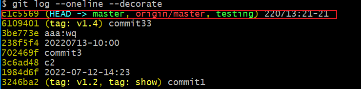
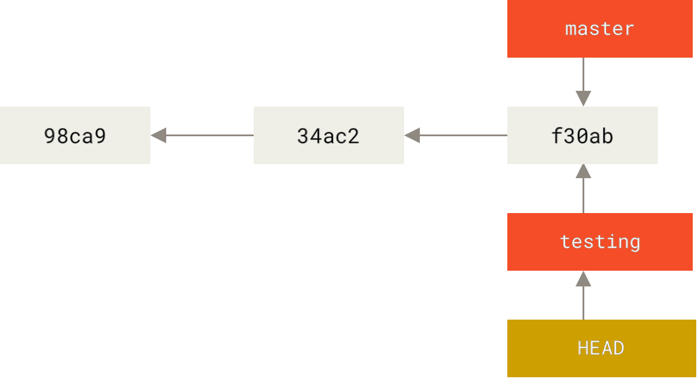
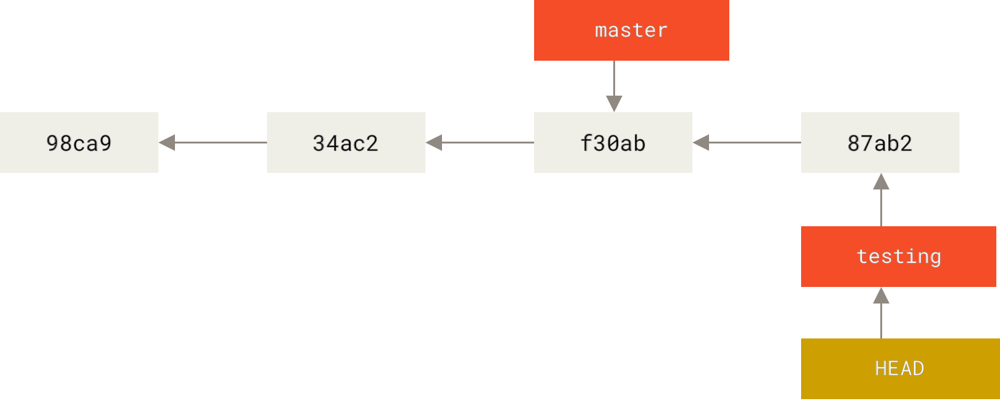
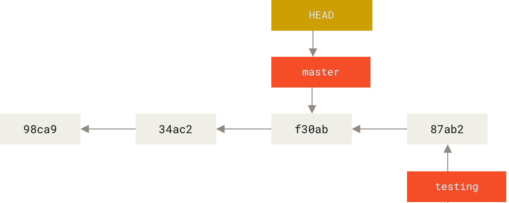
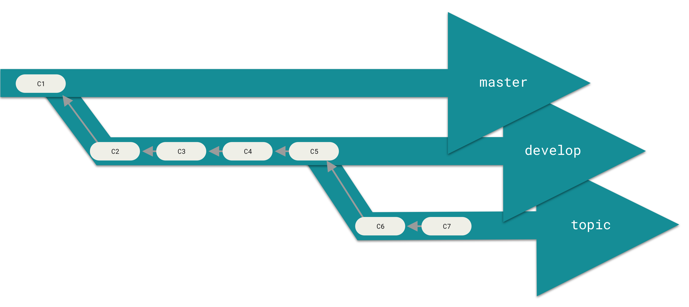
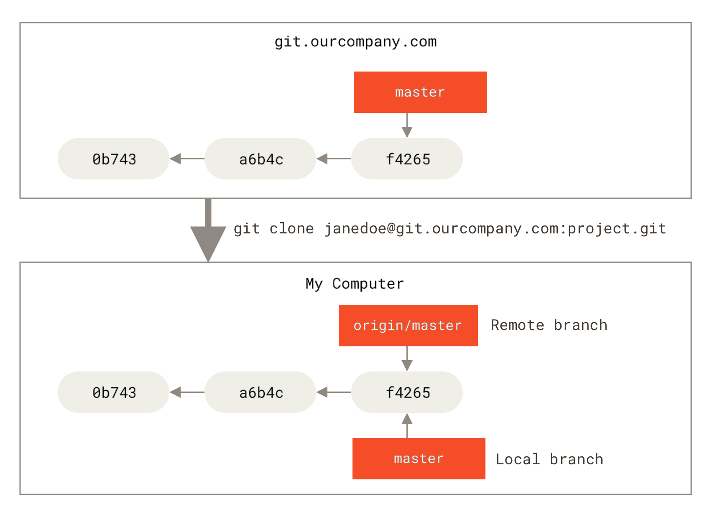
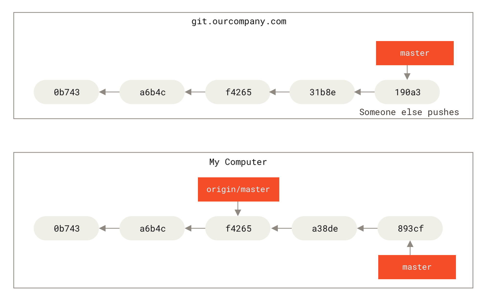
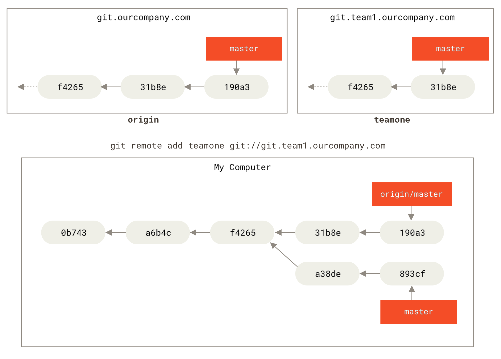
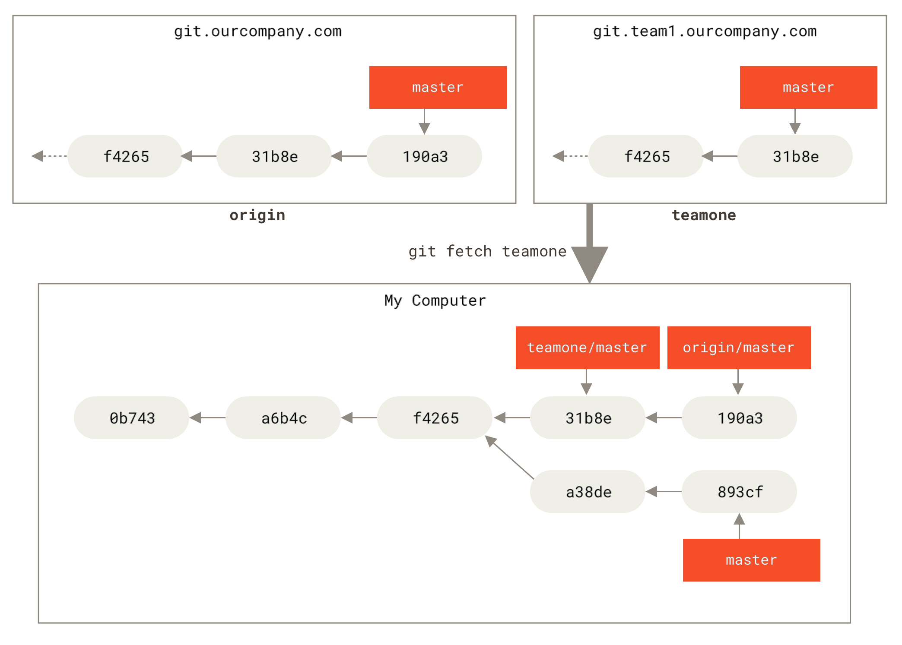

> 鸟不会飞，却活下来了！
>
> ​                       -“kiwi几维”老师

---


# 第三章 **Git** 分支

Git 鼓励在工作流 程中频繁地使用分支与合并，哪怕一天之内进行许多次。 

## **分支简介**

 Git 保存的不是文件的变化或者差异，而是一系列不同时刻的 **快照** 。

进行提交操作时，Git 会保存一个提交对象（commit object）。该提交对象会包含一个指向暂存内容快照的指针。 但不仅仅是这样，该提交对象还包含了作者的姓 名和邮箱、提交时输入的信息以及指向它的父对象的指针。 首次提交产生的提交对象没有父对象，普通提交操作产生的提交对象有一个父对象， 而由多个分支合并产生的提交对象有多个父对象。


 暂存操作会为每一个文件计算校验和（使用我们在 起步 中提到的 SHA-1 哈希算法），然后会把当前版本的文件快照保存到Git 仓库中 （Git 使用 blob 对象来保存它们），最终将校验和加入到暂存区域等待提交。当使用 git commit 进行提交操作时，Git 会先计算每一个子目录（本例中只有项目根目录）的校验和， 然后在 Git 仓库中这些校验和保存为树对象。随后，Git 便会创建一个提交对象， 它除了包含上面提到的那些信息外，还包含指向这个树对象（项目根目录）的指针。 如此一来，Git 就可以在需要的时候重现此次保存的快照。

现在，Git 仓库中有五个对象：三个 blob 对象（保存着文件快照）、一个 **树** 对象 （记录着目录结构和 blob 对象索引）以及一个 **提交** 对象（包含着指向前述树对象的指针和所有提交信息）。


做些修改后再次提交，那么这次产生的提交对象会包含一个指向上次提交对象（父对象）的指针。


Git 的分支，其实本质上仅仅是指向提交对象的可变指针。 Git 的默认分支名字是 master。 在多次提交操作之后，你其实已经有一个指向最后那个提交对象的 master 分支。 master 分支会在每次提交时自动向前移动。

>Git 的 master 分支并不是一个特殊分支。 它就跟其它分支完全没有区别。 之所以几乎每一个仓库都有 master 分支，是因为 git init 命令默认创建它，并且大多数人都懒得去改动它。


### **分支创建**

创建了一个可以移动的新的指针。 比如，创建一个 testing 分支， 你需要使用 git branch 命令：

`$ git branch testing`

这会在当前所在的提交对象上创建一个指针。


图 12. 两个指向相同提交历史的分支

那么，Git 又是怎么知道当前在哪一个分支上呢？ 也很简单，它有一个名为 HEAD 的特殊指针,指向当前所在的本地分支（译注：将 HEAD 想象为当前分支的别名）。在本例中，你仍然在master 分支上。 因为 git branch 命令仅仅 **创建** 一个新分支，并不会自动切换到新分支中去。


图 13. HEAD 指向当前所在的分支

使用 git log 命令查看各个分支当前所指的对象。 提供这一功能的参数是 --decorate。



```
$ git log --oneline --decorate
c1c5569 (HEAD -> master, origin/master, testing) 220713:21-21
6109401 (tag: v1.4) commit33
3be773e aaa:wq
238f5f4 20220713-10:00
702469f commit3
3c6ad48 c2
1984d6f 2022-07-12-14:23
3246ba2 (tag: v1.2, tag: show) commit1
```

正如你所见，当前 master 和 testing 分支均指向校验和以c1c5569 开头的提交对象。

### **分支切换**

要切换到一个已存在的分支，你需要使用 git checkout 命令。 我们现在切换到新创建的 testing 分支 

去：

`$ git checkout testing`



图14. HEAD 指向当前所在的分支

那么，这样的实现方式会给我们带来什么好处呢？ 现在不妨再提交一次：



图15. HEAD 分支随着提交操作自动向前移动

你的 testing 分支向前移动了，但是 master 分支却没有，它仍然指向运行 git checkout 时所

指的对象。 这就有意思了，现在我们切换回 master 分支看看：

` git checkout master`



图 16. 检出时 HEAD 随之移动

这条命令做了两件事。 一是使 HEAD 指回 master 分支，二是将工作目录恢复成 master 分支所指向的快照内容。 也就是说，你现在做修改的话，项目将始于一个较旧的版本。 本质上来讲，这就是忽略 testing 分支所做 的修改，以便于向另一个方向进行开发。

分支切换会改变你工作目录中的文件,在切换分支时，一定要注意你工作目录里的文件会被改变。 如果是切换到一个较旧的分支，你的工作目录会恢复到该分支最后一次提交时的样子。 如果 Git 不能干净利落地完成这个任 务，它将禁止切换分支。

我们不妨再稍微做些修改并提交：

$ vim test.rb

$ git commit -a -m 'made other changes'

现在，这个项目的提交历史已经产生了分叉（参见 项目分叉历史）。 因为刚才你创建了一个新分支，并切换过去进行了一些工作，随后又切换回 master 分支进行了另外一些工作。 上述两次改动针对的是不同分支：你可以在不同分支间不断地来回切换和工作，并在时机成熟时将它们合并起来。 而所有这些工作，你需要的命令只有branch、checkout 和 commit.


图 17. 项目分叉历史

你可以简单地使用 git log 命令查看分叉历史。 运行 git log --oneline --decorate --graph --all ，它会输出你的提交历史、各个分支的指向以及项目的分支分叉情况。

```
$ git log --oneline --decorate --graph --all
* 8e9ab77 (master) bmaster1
| * cb67859 (HEAD -> testing) testing 2
| * d2a9f03 submit testing
|/
* c1c5569 (origin/master) 220713:21-21
* 6109401 (tag: v1.4) commit33
* 3be773e aaa:wq
* 238f5f4 20220713-10:00
* 702469f commit3
* 3c6ad48 c2
* 1984d6f 2022-07-12-14:23
* 3246ba2 (tag: v1.2, tag: show) commit1
```

由于 Git 的分支实质上仅是包含所指对象校验和（长度为 40 的 SHA-1 值字符串）的文件，所以它的创建和销毁都异常高效。 创建一个新分支就相当于往一个文件中写入 41 个字节（40 个字符和 1 个换行符），如此的简单能不快吗？

在 Git 中，任何规模的项目都能在瞬间创建新分支。 同时，由于每次提交都会记录父对 象(上次的提交对象)，所以寻找恰当的合并基础（译注：即共同祖先）也是同样的简单和高效。 这些高效的特性使得 Git 鼓励开发人员频繁地创建和使用分支。

创建新分支的同时切换过去

通常我们会在创建一个新分支后立即切换过去，这可以用 git checkout -b <newbranchname> 一条命令搞定。

## 分支的新建与合并

### 分支的新建

- git checkout -b issue53

切换分支之前，保持好一个干净的状态。 有一些方法可以绕过这个问题（即，暂存（stashing） 和 修补提交（commit amending））.

git add *

git commit -amend 

git checkout <branch>

---

- git checkout master

 请牢记：当你切换分支的时候，Git 会重置你的工作目录，使其看起来像回到了你在那个分支上最后一次提交的样子。 Git 会自动添加、删除、修改文件以确保此时你的工作目录和这个分支最后一次提交时的样子一模一样。

---

$ git checkout -b hotfix

$ vim index.html

$ git commit -a -m 'fixed the broken email address'

$ git checkout master

---

```
Lenovo@LAPTOP-17JBE9VI MINGW64 /D/github_exercise/learn_progit (hotfix)
$ git checkout master
Switched to branch 'master'
Your branch is ahead of 'origin/master' by 1 commit.
  (use "git push" to publish your local commits)

Lenovo@LAPTOP-17JBE9VI MINGW64 /D/github_exercise/learn_progit (master)
$ git merge hotfix
Updating 8e9ab77..ec094d5
Fast-forward
 index.html | 1 +
 1 file changed, 1 insertion(+)
 create mode 100644 index.html

Lenovo@LAPTOP-17JBE9VI MINGW64 /D/github_exercise/learn_progit (master)
```

Fast-forward: 由于你想要合并的分支 hotfix 所指向的提交 C4 是你所在的提交 C2 的直接后继， 因此 Git 会直接将指针向前移动。换句话说，当你试图合并两个分支时， 如果顺着一个分支走下去能够到达另一个分支，那么 Git 在合并两者的时候， 只会简单的将指针向前推进 （指针右移），因为这种情况下的合并操作没有需要解决的分歧——这就叫做 “快进（fast-forward）”。


 git branch -d hotfix

### 分支的合并

git merge iss53

- Fast-forward:一个分支是另一个分支的直接祖先。
- recursive：master 分支所在提交并不是 iss53 分支所在提交的直接祖先，Git 不得不做一些额外的工作。 出现这种情况的时候，Git 会使用两个分支的末端所指的快照（C4 和 C5）以及这两个分支的公共祖先（C2），做一个简单的三方合并。Git 将此次三方合并的结果做了一个新的快照并且自动创建一个新的提交指向它。 这个被称作一次合并提交，它的特别之处在于他有不止一个父提交。

### **遇到冲突时的分支合并**

 如果你在两个不同的分支中，对同一个文件的同一个部分进行了不同的修改，Git 合并就会产生冲突！ Git 会暂停下来，等待你去解决合并产生的冲突。

```
$ git merge new1
Auto-merging readme.txt
CONFLICT (content): Merge conflict in readme.txt
Automatic merge failed; fix conflicts and then commit the result.
```

 你可以在合并冲突后的任意时刻使用 git status 命令来查看那些因包含合并冲突而处于未合并 （unmerged）状态的文件：合并冲突而有待解决的文件，都会以未合并状态标识出来。

```
$ git status
On branch master
You have unmerged paths.
  (fix conflicts and run "git commit")
  (use "git merge --abort" to abort the merge)
Unmerged paths:
  (use "git add <file>..." to mark resolution)
        both modified:   readme.txt
no changes added to commit (use "git add" and/or "git commit -a")
```

如何解决：

- vim 编辑处理

```
<<<<<<< HEAD
First edit , new re addi in master, and now edit in branch
=======
First edit edited in branch 1 in master, and now edit in branch
>>>>>>> new1
Second edit in new1
```

- git mergetool 你可以在 “下列工具中（one of the following tools）” 这句后面看到所有支持的合并工

  具。 然后输入你喜欢的工具名字就可以了。

- 如果你需要更加高级的工具来解决复杂的合并冲突，我们会在 高级合并 介绍更多关于分支合并的内容

## 分支管理

- git branch 当前分支列表

```
$ git branch -v
* master 452d992 master3
```

\* 字符：它代表现在检出的那一个分支（也就是说，当前 HEAD 指针所指向的分支）。

- git branch -v 查看每一个分支的最后一次提交
- --merged 与 --no-merged 这两个有用的选项可以过滤这个列表中已经合并或尚未合并到当前分支的分支。
- git branch -d 删除分支

## 分支开发流

### **长期分支**

许多使用 Git 的开发者都喜欢使用这种方式来工作，比如只在 master 分支上保留完全稳定的代码——有可能仅 仅是已经发布或即将发布的代码。  他们还有一些名为 develop 或者 next 的平行分支，被用来做后续开发或者测试稳定性——这些分支不必保持绝对稳定，但是一旦达到稳定状态，它们就可以被合并入 master 分支了。 一些大型项目还有一个 proposed（建议） 或 pu: proposed updates（建议更新）分支，它可能因包含一些不成熟的内容而不能进入 next 或者 master 分支。 这么做的目的是使你的分支具有不同级别的稳定性；当它们具有一定程度的稳定性后，再把它们合并入具有更高级别稳定性的分支中。 再次强调一下，使用多个长期分支的方法并非必要，但是这么做通常很有帮助，尤其是当你在一个非常庞大或者复杂的项目中工作时。

- master分支-发布或者即将发布的版本
- develop(next)-后续开发或者测试稳定性



### **主题分支**

主题分支是一种短期分支，它被用来实现单一特性或其相关工作。

## 远程分支

远程引用是对远程仓库的引用（指针），包括分支、标签等等。通过 git ls-remote <remote> 来 

显式地获得远程引用的完整列表， 或者通过 git remote show <remote> 获得远程分支的更多信息。 然

而，一个更常见的做法是利用远程跟踪分支。


远程跟踪分支是远程分支状态的引用。它们是你无法移动的本地引用。一旦你进行了网络通信， Git 就会为你移动它们以精确反映远程仓库的状态。请将它们看做书签， 这样可以提醒你该分支在远程仓库中的位置就是你最后一次连接到它们的位置。

它们以 <remote>/<branch> 的形式命名。 例如，如果你想要看你最后一次与远程仓库 origin 通信时

master 分支的状态，你可以查看 origin/master 分支。 你与同事合作解决一个问题并且他们推送了一个

iss53 分支，你可能有自己的本地 iss53 分支， 然而在服务器上的分支会以 origin/iss53 来表示。


远程跟踪分支是远程分支状态的引用。它们是你无法移动的本地引用。一旦你进行了网络通信， Git 就会为你移动它们以精确反映远程仓库的状态。请将它们看做书签， 这样可以提醒你该分支在远程仓库中的位置就是你最后一次连接到它们的位置。



如果你在本地的 master 分支做了一些工作，在同一段时间内有其他人推送提交到 git.ourcompany.com

并且更新了它的 master 分支，这就是说你们的提交历史已走向不同的方向。 即便这样，只要你保持不与

origin 服务器连接（并拉取数据），你的 origin/master 指针就不会移动。



如果要与给定的远程仓库同步数据,运行 git fetch <remote> 命令（在本例中为 git fetch origin）。

这个命令查找 “origin” 是哪一个服务器（在本例中，它是 git.ourcompany.com）， 从中抓取本地没有的

数据，并且更新本地数据库，移动 origin/master 指针到更新之后的位置。



为了演示有多个远程仓库与远程分支的情况，我们假定你有另一个内部 Git 服务器，仅服务于你的某个敏捷开发团队。 这个服务器位于 git.team1.ourcompany.com。 你可以运行 git remote add 命令添加一个新的远程仓库引用到当前的项目，这个命令我们会在 Git 基础 中详细说明。 将这个远程仓库命名为 teamone，将其作为完整 URL 的缩写。


现在，可以运行 git fetch teamone 来抓取远程仓库 teamone 有而本地没有的数据。 因为那台服务器上现

有的数据是 origin 服务器上的一个子集， 所以 Git 并不会抓取数据而是会设置远程跟踪分支teamone/master 指向 teamone 的 master 分支。



### **推送**

当你想要公开分享一个分支时，需要将其推送到有写入权限的远程仓库上。 本地的分支并不会自动与远程仓库同步——你必须显式地推送想要分享的分支。 这样，你就可以把不愿意分享的内容放到私人分支上，而将需要和别人协作的内容推送到公开分支。

 运行 git push <remote> <branch>

`$git push origin serverfix`

这里有些工作被简化了。 Git 自动将 serverfix 分支名字展开refs/heads/serverfix:refs/heads/serverfix， 那意味着，“推送本地的 serverfix分支来更新远程仓库上的 serverfix 分支。” 我们将会详细学习 Git 内部原理 的 refs/heads/ 部分， 但是现在可以先把它放在儿。你也可以运行 git push origin serverfix:serverfix， 它会做同样的事——也就是说“推送本地的 serverfix 分支，将其作为远程仓库的 serverfix 分支” 可以通过这种格式来推送本 地分支到一个命名不相同的远程分支。 如果并不想让远程仓库上的分支叫做 serverfix，可以运行 git push origin serverfix:awesomebranch 来将本地的 serverfix 分支推送到远程仓库上的 awesomebranch 分支。

下一次其他协作者从服务器上抓取数据时，他们会在本地生成一个远程分支 origin/serverfix，指向服务器的 serverfix 分支的引用。要特别注意的一点是当抓取到新的远程跟踪分支时，本地不会自动生成一份可编辑的副本（拷贝）。 换一句话说，这种情况下，不会有一个新的 serverfix 分支--只有一个不可以修改的 origin/serverfix 指针。可以运行 git merge origin/serverfix 将这些工作合并到当前所在的分支。 如果想要在自己的serverfix 分支上工作，可以将其建立在远程跟踪分支之上：

`$git checkout -b serverfix origin/serverfix`

这会给你一个用于工作的本地分支，并且起点位于 origin/serverfix。

### **跟踪分支**

从一个远程跟踪分支检出一个本地分支会自动创建所谓的“跟踪分支”（它跟踪的分支叫做“上游分支”）。跟踪分支是与远程分支有直接关系的本地分支。如果在一个跟踪分支上输入 git pull，Git 能自动地识别去哪个服务器上抓取、合并到哪个分支。

当克隆一个仓库时，它通常会自动地创建一个跟踪 origin/master 的 master 分支。 然而，如果你愿意的话可以设置其他的跟踪分支，或是一个在其他远程仓库上的跟踪分支，又或者不跟踪 master 分支。 最简单的实 例就是像之前看到的那样，运行 git checkout -b <branch> <remote>/<branch>。 这是一个十分常用的操作所以 Git 提供了 --track 快捷方式：

$ git checkout --track origin/serverfix

由于这个操作太常用了，该捷径本身还有一个捷径。 如果你尝试检出的分支 (a) 不存在且 (b) 刚好只有一个名字与之匹配的远程分支，那么 Git 就会为你创建一个跟踪分支：

 $git checkout serverfix

如果想要将本地分支与远程分支设置为不同的名字，你可以轻松地使用上一个命令增加一个不同名字的本地分 支：

$ git checkout -b sf origin/serverfix

现在，本地分支 sf 会自动从 origin/serverfix 拉取。

设置已有的本地分支跟踪一个刚刚拉取下来的远程分支，或者想要修改正在跟踪的上游分支， 你可以在任意时

间使用 -u 或 --set-upstream-to 选项运行 git branch 来显式地设置。

$ git branch -u origin/serverfix

当设置好跟踪分支后，可以通过简写 @{upstream} 或 @{u} 来引用它的上游分支。 所以在master 分支时并且它正在跟踪 origin/master 时，如果愿意的话可以使用 git merge @{u} 来取代 git merge origin/master。 

如果想要查看设置的所有跟踪分支，可以使用 git branch 的 -vv 选项。 这会将所有的本地分支列出来并且包 含更多的信息，如每一个分支正在跟踪哪个远程分支与本地分支是否是领先、落后或是都有。

```
$ git branch -vv
  iss53 7e424c3 [origin/iss53: ahead 2] forgot the brackets
  master 1ae2a45 [origin/master] deploying index fix
* serverfix f8674d9 [teamone/server-fix-good: ahead 3, behind 1] this
should do it
  testing 5ea463a trying something new
```

这里可以看到 iss53 分支正在跟踪 origin/iss53 并且 “ahead” 是 2，意味着本地有两个提交还没有推送到服务器上。

也能看到 master 分支正在跟踪 origin/master 分支并且是最新的。 

接下来可以看到serverfix 分支正在跟踪 teamone 服务器上的 server-fix-good 分支并且领先 3 落后 1， 意味着服务器上有一次提交还没有合并入同时本地有三次提交还没有推送。 最后看到 testing 分支并没有跟踪任何远程分支。


需要重点注意的一点是这些数字的值来自于你从每个服务器上最后一次抓取的数据。 这个命令并没有连接服务器，它只会告诉你关于本地缓存的服务器数据。 如果想要统计最新的领先与落后数字，需要在运行此命令前抓取所有的远程仓库。 可以像这样做：

`$ git fetch --all; git branch -vv`

### **拉取**

当 git fetch 命令从服务器上抓取本地没有的数据时，它并不会修改工作目录中的内容。 它只会获取数据然 后让你自己合并。 然而，有一个命令叫作 git pull 在大多数情况下它的含义是一个 git fetch 紧接着一个git merge 命令。 如果有一个像之前章节中演示的设置好的跟踪分支，不管它是显式地设置还是通过 clone或 checkout 命令为你创建的，git pull 都会查找当前分支所跟踪的服务器与分支， 从服务器上抓取数据然 后尝试合并入那个远程分支。由于 git pull 的魔法经常令人困惑所以通常单独显式地使用 fetch 与 merge 命令会更好一些。

### **删除远程分支**

```
$ git push origin --delete serverfix

To https://github.com/schacon/simplegit

 \- [deleted] serverfix
```

基本上这个命令做的只是从服务器上移除这个指针。 Git 服务器通常会保留数据一段时间直到垃圾回收运行，所以如果不小心删除掉了，通常是很容易恢复的。

## 变基

在 Git 中整合来自不同分支的修改主要有两种方法：merge 以rebase。 在本节中我们将学习什么是“变基”，怎样使用“变基”，并将展示该操作的惊艳之处，以及指出在何种情况下你应避免使用它。

### **变基的基本操作**

首先找到这两个分支（即当前分支 experiment、变基操作的目标基底分支 master） 的最近共同祖先 C2，然后对比当前分支相对于该祖先的历次提交，提取相应的修改并存为临时文件， 然后将当前分支指向目标基底 C3, 最后以此将之前另存为临时文件的修改依序应用。

```
$ git checkout experiment
$ git rebase master
$ git checkout master
$ git merge experiment
```

> 这两种整合方法的最终结果没 

有任何区别，但是变基使得提交历史更加整洁。 你在查看一个经过变基的分支的历史记录时会发现，尽管实际的开发工作是并行的， 但它们看上去就像是串行的一样，提交历史是一条直线没有分叉。

### **更有趣的变基例子**

在对两个分支进行变基时，所生成的“重放”并不一定要在目标分支上应用，你也可以指定另外的一个分支进行应用。可以使用 git rebase 命令的 --onto 选项， 选中在 client 分支里但不在server 分支里的修改（即 C8 和 C9），将它们在 master 分支上重放：

$ git rebase --onto master server client

“取出 client 分支，找出它从 server 分支分歧之后的补丁， 然后把这些补丁在master 分支上重放一遍，让 client 看起来像直接基于 master 修改一样”。这理解起来有一点复杂，不过效果非常酷。

$ git checkout master

$ git merge client

接下来你决定将 server 分支中的修改也整合进来。 使用 git rebase <basebranch> <topicbranch> 命

令可以直接将主题分支 （即本例中的 server）变基到目标分支（即 master）上。 这样做能省去你先切换到

server 分支，再对其执行变基命令的多个步骤。

$ git rebase master server

如图 将 server 中的修改变基到 master 上 所示，server 中的代码被“续”到了 master 后面。

然后就可以快进合并主分支 master 了：

$ git checkout master

$ git merge server

至此，client 和 server 分支中的修改都已经整合到主分支里了， 你可以删除这两个分支，最终提交历史会变 

成图 最终的提交历史 中的样子：

$ git branch -d client

$ git branch -d server

### 变基的风险

如果提交存在于你的仓库之外，而别人可能基于这些提交进行开发，那么不要执行变基。

### 用变基解决变基

在本例中另一种简单的方法是使用 git pull --rebase 命令而不是直接 git pull。 又或者你可以自己手动 完成这个过程，先 git fetch，再 git rebase teamone/master。 如果你习惯使用 git pull ，同时又希望默认使用选项 --rebase，你可以执行这条语句 git config --global pull.rebase true 来更改 pull.rebase 的默认配置。

如果你只对不会离开你电脑的提交执行变基，那就不会有事。 如果你对已经推送过的提交执行变基，但别人没 有基于它的提交，那么也不会有事。 如果你对已经推送至共用仓库的提交上执行变基命令，并因此丢失了一些别人的开发所基于的提交， 那你就有大麻烦了，你的同事也会因此鄙视你。 

如果你或你的同事在某些情形下决意要这么做，请一定要通知每个人执行 git pull --rebase 命令，这样尽管不能避免伤痛，但能有所缓解。

### 变基 **vs.** **合并**

有一种观点认为，仓库的提交历史即是 记录实际发生过什么。 它是针对历史的文档，本身就有价值，不能乱改。 从这个角度看来，改变提交历史是一种亵渎，你使用 谎言 掩盖了实际发生过的事情。 如果由合并产生的提交历史是一团糟怎么办？ 既然事实就是如此，那么这些痕迹就应该被保留下来，让后人能够查阅。

另一种观点则正好相反，他们认为提交历史是 **项目过程中发生的事。 没人会出版一本书的第一版草稿，软件维 护手册也是需要反复修订才能方便使用。 持这一观点的人会使用 rebase 及 filter-branch 等工具来编写故事，怎么方便后来的读者就怎么写。

现在，让我们回到之前的问题上来，到底合并还是变基好？希望你能明白，这并没有一个简单的答案。 Git 是一个非常强大的工具，它允许你对提交历史做许多事情，但每个团队、每个项目对此的需求并不相同。 既然你已 经分别学习了两者的用法，相信你能够根据实际情况作出明智的选择。 

总的原则是，只对尚未推送或分享给别人的本地修改执行变基操作清理历史， 从不对已推送至别处的提交执行变基操作，这样，你才能享受到两种方式带来的便利。

**总结**

我们已经讲完了 Git 分支与合并的基础知识。 你现在应该能自如地创建并切换至新分支、在不同分支之间切换以 及合并本地分支。 你现在应该也能通过推送你的分支至共享服务以分享它们、使用共享分支与他人协作以及在共享之前使用变基操作合并你的分支。 下一章，我们将要讲到，如果你想要运行自己的 Git 仓库托管服务器，你需要知道些什。