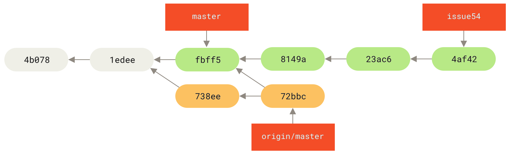
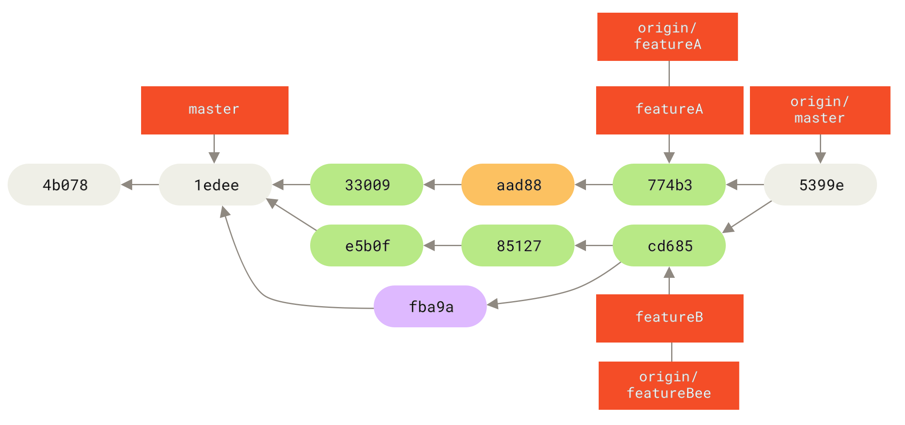

# 第五章 分布式 **Git**

这一章中，你将会学习如何作为贡献者或整合者，在一个分布式协作的环境中使用Git。 你会学习为一个项目成 功地贡献代码，并接触一些最佳实践方式，让你和项目的维护者能轻松地完成这个过程。另外，你也会学到如何管理有很多开发者提交贡献的项目。

## 分布式工作流程

在 Git 中，每个开发者既可以将自己的代码贡献到其他的仓库中，同时也能维护自己的公开仓库， 让其他人可以在其基础上工作并贡献代码。 

### 集中式工作流

集中式系统中通常使用的是单点协作模型，一个中心仓库，可以接受代码，所有人将自己的工作与之同步。 如果两个开发者从中心仓库克隆代码下来，同时作了一些修改，那么只有第一个开发者可以顺利地把数据推送回共享服务器。 第二个开发者在推送修改之前，必须先将第一个人的工作合并进来，这样才不会覆盖第一个人的修改。


图 54. 集中式工作流。

### 集成管理者工作流

Git 允许多个远程仓库存在，使得这样一种工作流成为可能：每个开发者拥有自己仓库的写权限和其他所有人仓库的读权限。 这种情形下通常会有个代表“官方”项目的权威的仓库。 要为这个项目做贡献，你需要从该项目克隆出一个自己的公开仓库，然后将自己的修改推送上去。 接着你可以请求官方仓库的维护者拉取更新合并到主项目。 维护者可以将你的仓库作为远程仓库添加进来，在本地测试你的变更，将其合并入他们的分支并推送回官方仓库。 这一流程的工作方式如下所示（见 集成管理者工作流。）：

1. 项目维护者推送到主仓库。

2. 贡献者克隆此仓库，做出修改。

3. 贡献者将数据推送到自己的公开仓库。

4. 贡献者给维护者发送邮件，请求拉取自己的更新。

5. 维护者在自己本地的仓库中，将贡献者的仓库加为远程仓库并合并修改。

6. 维护者将合并后的修改推送到主仓库。


图表 55. 集成管理者工作流

这是 GitHub 和 GitLab 等集线器式（hub-based）工具最常用的工作流程。人们可以容易地将某个项目派生成为自己的公开仓库，向这个仓库推送自己的修改，并为每个人所见。 这么做最主要的优点之一是你可以持续地工作，而主仓库的维护者可以随时拉取你的修改。 贡献者不必等待维护者处理完提交的更新—每一方都可以按照自己的节奏工作。

### 主管与副主管工作流

这其实是多仓库工作流程的变种。 一般拥有数百位协作开发者的超大型项目才会用到这样的工作方式，例如著名的 Linux 内核项目。 被称为副主管（lieutenant）的各个集成管理者分别负责集成项目中的特定部分。 所有这些副主管头上还有一位称为主管（dictator） 的总集成管理者负责统筹。 主管维护的仓库作为参考仓库，为所有协作者提供他们需要拉取的项目代码。 整个流程看起来是这样的（见 主管与副主管工作流。 ）：

1. 普通开发者在自己的主题分支上工作，并根据 master 分支进行变基。 这里是主管推送的参考仓库的

master 分支。

2. 副主管将普通开发者的主题分支合并到自己的 master 分支中。

3. 主管将所有副主管的 master 分支并入自己的 master 分支中。

4. 最后，主管将集成后的 master 分支推送到参考仓库中，以便所有其他开发者以此为基础进行变基。


图56. 主管与副主管工作流

这种工作流程并不常用，只有当项目极为庞杂，或者需要多级别管理时，才会体现出优势。利用这种方式，项目总负责人（即主管）可以把大量分散的集成工作委托给不同的小组负责人分别处理，然后在不同时刻将大块的代码子集统筹起来，用于之后的整合。

### **工作流程总结**

上面介绍了在 Git 等分布式系统中经常使用的工作流程，但是在实际的开发中，你会遇到许多可能适合你的特定工作流程的变种。 现在你应该已经清楚哪种工作流程组合可能比较适合你了，我们会给出一些如何扮演不同工作流程中主要角色的更具体的例子。 下一节我们将会学习为项目做贡献的一些常用模式。

## 向一个项目贡献

###  提交准则

**有一个好的创建提交的准则并且坚持使用会让与 Git 工作和与其他人协作更容易**。 Git 项目提供了一个文档，其中列举了关于创建提交到提交补丁的若干好的提示——可以在 Git 源代码中的 Documentation/SubmittingPatches 文件中阅读它。

- 首先，你的提交不应该包含任何空白错误。 Git 提供了一个简单的方式来检查这点——在提交前，运行 git diff --check，它将会找到可能的空白错误并将它们为你列出来。

- 接下来，尝试让每一个提交成为一个逻辑上的独立变更集。 

> 如果可以，尝试让改动可以理解-不要在整个周末编码解决五个问题，然后在周一时将它们提交为一个巨大的提交。 即使在周末期间你无法提交，在周一时使用暂存区域将你的工作最少拆分为每个问题一个提交，并且为每一个提交附带一个有用的信息。 

如果其中一些改动修改了同一个文件，尝试使用 git add --patch 来部分暂存文件（在 交互式暂存 中有详细介绍）。当你之后需要时这个方法也会使拉出或还原一个变更集更容易些。 重写历史 描述了重写历史与交互式暂存文件的若干有用的 Git 技巧——在将工作发送给其他人前使用这些工具来帮助生成一个干净又易懂的历史。 

- 最后一件要牢记的事是提交信息。 有一个创建优质提交信息的习惯会使 Git 的使用与协作容易的多。 一般情况下，信息应当以少于 50 个字符（25个汉字）的单行开始且简要地描述变更，接着是一个空白行，再接着是一个更详细的解释。 Git 项目要求一个更详细的解释，包括做改动的动机和它的实现与之前行为的对比——这是一个值得遵循的好规则。 使用指令式的语气来编写提交信息，比如使用“Fix bug”而非“Fixed bug”或“Fixes bug”。 这里是一份 最初由 Tim Pope 写的模板：

```
首字母大写的摘要（不多于 50 个字符） 如果必要的话，加入更详细的解释文字。在大概 72 个字符的时候换行。 在某些情形下，第一行被当作一封电子邮件的标题，剩下的文本作为正文。 分隔摘要与正文的空行是必须的（除非你完全省略正文），
如果你将两者混在一起，那么类似变基等工具无法正常工作。
使用指令式的语气来编写提交信息：使用“Fix bug”而非“Fixed bug”或“Fixes bug”。 此约定与 git merge 和 git revert 命令生成提交说明相同。
空行接着更进一步的段落。
- 标号也是可以的。
- 项目符号可以使用典型的连字符或星号，后跟一个空格，行之间用空行隔开， 但是可以依据不同的惯例有所不同。
- 使用悬挂式缩进
```

如果你所有的提交信息都遵循此模版，那么对你和与你协作的其他开发者来说事情会变得非常容易。 Git 项目有一个良好格式化的提交信息——尝试在那儿运行 git log --no-merges 来看看漂亮的格式化的项目提交历史像什么样。

> 按我们说的去做，不要照着我们做的去做。 
>
> *Do as we say, not as we do*
>
> 为简单起见，本书中很多例子的提交说明并没有遵循这样良好的格式， 我们只是对 git commit 使用了 -m 选项。简而言之，按我们说的去做，不要照着我们做的去做。 

###  私有小型团队

你可能会遇到的最简单的配置是有一两个其他开发者的私有项目。这其实也是我们可能遇到的情况！ “私有” 在这个上下文中，意味着闭源——不可以从外面的世界中访问到。 你和其他的开发者都有仓库的推送权限。

让我们看看当两个开发者在一个共享仓库中一起工作时会是什么样子。 第一个开发者，John，克隆了仓库，做了改动，然后本地提交。

```
# John's Machine
$ git clone john@githost:simplegit.git
Cloning into 'simplegit'...
...
$ cd simplegit/
$ vim lib/simplegit.rb
$ git commit -am 'remove invalid default value'
[master 738ee87] remove invalid default value
 1 files changed, 1 insertions(+), 1 deletions(-)
```

第二个开发者，Jessica，做了同样的事情——克隆仓库并提交了一个改动：

```
# Jessica's Machine
$ git clone jessica@githost:simplegit.git
Cloning into 'simplegit'...
...
$ cd simplegit/
$ vim TODO
$ git commit -am 'add reset task'
[master fbff5bc] add reset task
 1 files changed, 1 insertions(+), 0 deletions(-)
```

现在，Jessica 把她的工作推送到服务器上，一切正常：

```
# Jessica's Machine
$ git push origin master
...
To jessica@githost:simplegit.git
  1edee6b..fbff5bc master -> master
```

上方输出信息中最后一行显示的是推送操作执行完毕后返回的一条很有用的消息。 消息的基本格式是

<oldref>..<newref> fromref -> toref ， oldref 的含义是推送前所指向的引用， newref 的含义是

推送后所指向的引用，fromref 是将要被推送的本地引用的名字，toref 是将要被更新的远程引用的名字。在后面的讨论中你还会看到类似的输出消息，所以对这条消息的含义有一些基础的了解将会帮助你理解仓库的诸多状态。 想要了解更多细节请访问文档 git-push 。

John 稍候也做了些改动，将它们提交到了本地仓库中，然后试着将它们推送到同一个服务器：

```
# John's Machine
$ git push origin master
To john@githost:simplegit.git
 ! [rejected] master -> master (non-fast forward)
error: failed to push some refs to 'john@githost:simplegit.git'
```

这时 John 会推送失败，因为之前 Jessica 已经推送了她的更改, Git 要求你先在本地合并提交。 换言之，John 必须先抓取 Jessica 的上游改动并将它们合并到自己的本地仓库中，才能被允许推送。

第一步，John 抓取 Jessica 的工作（这只会 **抓取** Jessica 的上游工作，并不会将它合并到 John 的工作中）：

```
$ git fetch origin
...
From john@githost:simplegit
 + 049d078...fbff5bc master -> origin/master
```

在这个时候，John 的本地仓库看起来像这样：


图 58. John 的分叉历史

现在 John 可以将抓取下来的 Jessica 的工作合并到他自己的本地工作中了：

```
$ git merge origin/master
Merge made by the 'recursive' strategy.
 TODO | 1 +
 1 files changed, 1 insertions(+), 0 deletions(-)
```

合并进行得很顺利——John 更新后的历史现在看起来像这样：


图59. 合并了origin/master之后 John的仓库

此时，John 可能想要测试新的代码，以确保 Jessica 的工作没有影响他自己的工作， 当一切正常后，他就能将 新合并的工作推送到服务器了：

```
$ git push origin master
...
To john@githost:simplegit.git
  fbff5bc..72bbc59 master -> master
```

最终，John的提交历史看起来像这样：


图60. 推送到origin服务器后 John的历史

在此期间，Jessica 新建了一个名为 issue54 的主题分支，然后在该分支上提交了三次。 她还没有抓取 John的改动，所以她的提交历史看起来像这样：


图 61. Jessica 的主题分支

忽然，Jessica 发现 John 向服务器推送了一些新的工作，她想要看一下， 于是就抓取了所有服务器上的新内容：

```
# Jessica's Machine
$ git fetch origin
...
From jessica@githost:simplegit
  fbff5bc..72bbc59 master -> origin/master
```

那会同时拉取 John 推送的工作。 Jessica 的历史现在看起来像这样：



图表 62. 抓取 John 的改动后 Jessica 的历史

Jessica 认为她的主题分支已经准备好了，但她想知道需要将 John 工作的哪些合并到自己的工作中才能推送。 她运行 git log 找了出来：

```
$ git log --no-merges issue54..origin/master
commit 738ee872852dfaa9d6634e0dea7a324040193016
Author: John Smith <jsmith@example.com>
Date: Fri May 29 16:01:27 2009 -0700
  remove invalid default value
```

issue54..origin/master 语法是一个日志过滤器，要求 Git 只显示所有在后面分支 （在本例中是origin/master）但不在前面分支（在本例中是 issue54）的提交的列表。 我们将会在 提交区间 中详细介绍这个语法。

目前，我们可以从输出中看到有一个 John 生成的但是 Jessica 还没有合并的提交。 如果她合并

origin/master，那个未合并的提交将会修改她的本地工作。

现在，Jessica 可以合并她的特性工作到她的 master 分支， 合并 John 的工作（origin/master）进入她的master 分支，然后再次推送回服务器。 

首先（在已经提交了所有 issue54 主题分支上的工作后），为了整合所有这些工作， 她切换回她的 master 分支。

```
$ git checkout master
Switched to branch 'master'
Your branch is behind 'origin/master' by 2 commits, and can be fastforwarded.
```

Jessica 既可以先合并 origin/master 也可以先合并 issue54 ——它们都是上游，所以顺序并没有关系。 不论她选择的顺序是什么最终的结果快照是完全一样的；只是历史会稍微有些不同。 她选择先合并 issue54：

```
$ git merge issue54
Updating fbff5bc..4af4298
Fast forward
 README | 1 +
 lib/simplegit.rb | 6 +++++-
 2 files changed, 6 insertions(+), 1 deletions(-)
```

没有发生问题，如你所见它是一次简单的快进合并。 现在 Jessica 在本地合并了之前抓取的 origin/master分支上 John 的工作：

```
$ git merge origin/master
Auto-merging lib/simplegit.rb
Merge made by the 'recursive' strategy.
 lib/simplegit.rb | 2 +-
 1 files changed, 1 insertions(+), 1 deletions(-)
```

每一个文件都干净地合并了，Jessica 的历史现在看起来像这样：


图表 63. 合并了 John 的改动后 Jessica 的历史

现在 origin/master 是可以从 Jessica 的 master 分支到达的， 所以她应该可以成功地推送（假设同一时间John 并没有更多推送）：

```
$ git push origin master
...
To jessica@githost:simplegit.git
  72bbc59..8059c15 master -> master
```

每一个开发者都提交了几次并成功地合并了其他人的工作。


图表 64. 推送所有的改动回服务器后 Jessica 的历史

这是一个最简单的工作流程。 你通常会在一个主题分支上工作一会儿，当它准备好整合时就合并到你的 master分支。 当想要共享工作时，如果有改动的话就抓取它然后合并到你自己的 master 分支， 之后推送到服务器上的 master 分支。通常顺序像这样：


图表 65. 一个简单的多人 Git 工作流程的通常事件顺序

### **私有管理团队**

在接下来的场景中，你会看到大型私有团队中贡献者的角色。 你将学到如何在这种工作环境中工作，其中小组基于特性进行协作，而这些团队的贡献将会由其他人整合。

让我们假设 John 与 Jessica 在一个特性（featureA）上工作， 同时 Jessica 与第三个开发者 Josie 在第二个特性（featureB）上工作。 在本例中，公司使用了一种整合-管理者工作流程，独立小组的工作只能被特定的工程师整合， 主仓库的 master 分支只能被那些工程师更新。 在这种情况下，所有的工作都是在基于团队的分支上完成的并且稍后会被整合者拉到一起。

因为 Jessica 在两个特性上工作，并且平行地与两个不同的开发者协作，让我们跟随她的工作流程。 假设她已经克隆了仓库，首先决定在 featureA 上工作。 她为那个特性创建了一个新分支然后在那做了一些工作：

```
# Jessica's Machine
$ git checkout -b featureA
Switched to a new branch 'featureA'
$ vim lib/simplegit.rb
$ git commit -am 'add limit to log function'
[featureA 3300904] add limit to log function
 1 files changed, 1 insertions(+), 1 deletions(-)
```

在这个时候，她需要将工作共享给 John，所以她推送了 featureA 分支的提交到服务器上。 Jessica 没有master 分支的推送权限——只有整合者有——所以为了与 John 协作必须推送另一个分支。

```
$ git push -u origin featureA
...
To jessica@githost:simplegit.git
 * [new branch] featureA -> featureA
```

Jessica 向 John 发邮件告诉他已经推送了一些工作到 featureA 分支现在可以看一看。 当她等待 John 的反馈时，Jessica 决定与 Josie 开始在 featureB 上工作。 为了开始工作，她基于服务器的 master 分支开始了一个新分支。

```
# Jessica's Machine
$ git fetch origin
$ git checkout -b featureB origin/master
Switched to a new branch 'featureB'
```

现在，Jessica 在 featureB 分支上创建了几次提交：

```
$ vim lib/simplegit.rb
$ git commit -am 'made the ls-tree function recursive'
[featureB e5b0fdc] made the ls-tree function recursive
 1 files changed, 1 insertions(+), 1 deletions(-)
$ vim lib/simplegit.rb
$ git commit -am 'add ls-files'
[featureB 8512791] add ls-files
 1 files changed, 5 insertions(+), 0 deletions(-)
```

现在 Jessica 的仓库看起来像这样：


图66. Jessica 的初始提交历史

她准备好推送工作了，但是一封来自 Josie 的邮件告知一些初始的“featureB” 工作已经被推送到服务器的featureBee 上了。 Jessica 在能够将她的工作推送到服务器前，需要将那些改动与她自己的合并。 她首先通过 git fetch 抓取了 Josie 的改动：

```
$ git fetch origin
...
From jessica@githost:simplegit
 * [new branch] featureBee -> origin/featureBee
```

假设 Jessica 还在她检出的 featureB 分支上，现在可以通过 git merge 将其合并到她做的工作中了：

```
$ git merge origin/featureBee
Auto-merging lib/simplegit.rb
Merge made by the 'recursive' strategy.
 lib/simplegit.rb | 4 ++++
 1 files changed, 4 insertions(+), 0 deletions(-)
```

此时，Jessica 想要将所有合并后的“featureB”推送回服务器，，但她并不想直接推送她自己的 featureB 分支。 由于 Josie 已经开启了一个上游的 featureBee 分支，因此 Jessica 想要推送到 **这****个** 分支上，于是她这样做：

```
$ git push -u origin featureB:featureBee
...
To jessica@githost:simplegit.git
  fba9af8..cd685d1 featureB -> featureBee
```

这称作一个 引用规范。 查看 引用规范 了解关于 Git 引用规范与通过它们可以做的不同的事情的详细讨论。 也要注意 -u 标记；这是 --set-upstream 的简写，该标记会为之后轻松地推送与拉取配置分支。


紧接着，John 发邮件给 Jessica 说他已经推送了一些改动到 featureA 分支并要求她去验证它们。 她运行一个git fetch 来拉取下那些改动：

```
$ git fetch origin
...
From jessica@githost:simplegit
  3300904..aad881d featureA -> origin/featureA
```

Jessica 通过比较新抓取的 featureA 分支和她同一分支的本地副本，看到了 John 的新工作日志。

```
$ git log featureA..origin/featureA
commit aad881d154acdaeb2b6b18ea0e827ed8a6d671e6
Author: John Smith <jsmith@example.com>
Date: Fri May 29 19:57:33 2009 -0700
  changed log output to 30 from 25
```

如果 Jessica 觉得可以，她就能将 John 的新工作合并到她本地的 featureA 分支上：

```
$ git checkout featureA
Switched to branch 'featureA'
$ git merge origin/featureA
Updating 3300904..aad881d
Fast forward
 lib/simplegit.rb | 10 +++++++++-
1 files changed, 9 insertions(+), 1 deletions(-)
```

最后，Jessica 可能想要对整个合并后的内容做一些小修改， 于是她将这些修改提交到了本地的 featureA 分支，接着将最终的结果推送回了服务器。

```
$ git commit -am 'small tweak'
[featureA 774b3ed] small tweak
 1 files changed, 1 insertions(+), 1 deletions(-)
$ git push
...
To jessica@githost:simplegit.git
  3300904..774b3ed featureA -> featureA
```

Jessica 的提交历史现在看起来像这样：


这时，Jessica、Josie 与 John 通知整合者服务器上的 featureA 与 featureBee 分支准备好整合到主线中了。 在整合者将这些分支合并到主线后，就能一次将这个新的合并提交抓取下来，历史看起来就会像这样：



许多团队切换到 Git 就是看中了这种能让多个团队并行工作、并在之后合并不同工作的能力。 团队中更小一些的子小组可以通过远程分支协作而不必影响或妨碍整个团队的能力是 Git 的一个巨大优势。 在这儿看到的工作流程顺序类似这样：


图表 69. 这种管理团队工作流程的基本顺序

### **派生的公开项目**

向公开项目做贡献有一点儿不同。 因为没有权限直接更新项目的分支，你必须用其他办法将工作给维护者。 第一个例子描述在支持简单派生的 Git 托管上使用派生来做贡献。 许多托管站点支持这个功能（包括GitHub、BitBucket、repo.or.cz 等等），许多项目维护者期望这种风格的贡献。 下一节会讨论偏好通过邮件接 受贡献补丁的项目。

首先，你可能想要克隆主仓库，为计划贡献的补丁或补丁序列创建一个主题分支，然后在那儿做工作。 顺序看起来基本像这样：

```
$ git clone <url>
$ cd project
$ git checkout -b featureA
  ... work ...
$ git commit
  ... work ...
$ git commit
```

> 你可以用 rebase -i 将工作压缩成一个单独的提交，或者重排提交中的工作使补丁更容易被维护者审核—查看 重写历史 了解关于交互式变基的更多信息。

当你的分支工作完成后准备将其贡献回维护者，去原始项目中然后点击“Fork”按钮，创建一份自己的可写的项目派生仓库。 然后需要在本地仓库中将该仓库添加为一个新的远程仓库，在本例中称作 myfork：

```
 git remote add myfork <url>
```

然后需要推送工作到上面。 相对于合并到主分支再推送上去，推送你正在工作的主题分支到仓库上更简单。

原因是工作如果不被接受或者是被拣选的，就不必回退你的 master 分支 （拣选操作 cherry-pick 详见 变基与 拣选工作流）。 如果维护者合并、变基或拣选你的工作，不管怎样你最终会通过拉取他们的仓库找回来你的工作。

在任何情况下，你都可以使用下面的命令推送你的工作：

```
$ git push -u myfork featureA
```

当工作已经被推送到你的派生仓库后，你需要通知原项目的维护者你有想要他们合并的工作。 这通常被称作一个 **拉取请求（Pull Request），你通常可以通过网站生成它—— GitHub 有它自己的 Pull Request 机制，我们将会在 GitHub 介绍—也可以运行 git request-pull 命令然后将随后的输出通过电子邮件手动发送给项目维护者。

git request-pull 命令接受一个要拉取主题分支的基础分支，以及它们要拉取的 Git 仓库的 URL， 产生一个请求拉取的所有修改的摘要。 例如，Jessica 想要发送给 John 一个拉取请求，她已经在刚刚推送的分支上做了 两次提交。她可以运行这个：

```
$ git request-pull origin/master myfork
The following changes since commit
1edee6b1d61823a2de3b09c160d7080b8d1b3a40:
Jessica Smith (1):
  added a new function
are available in the git repository at:
  git://githost/simplegit.git featureA
Jessica Smith (2):
  add limit to log function
  change log output to 30 from 25
 lib/simplegit.rb | 10 +++++++++-
 1 files changed, 9 insertions(+), 1 deletions(-)
```

此输出可被发送给维护者——它告诉他们工作是从哪个分支开始的、提交的摘要、以及从哪里拉取这些工作。

在一个你不是维护者的项目上，通常有一个总是跟踪 origin/master 的 master 分支会很方便，在主题分支上做工作是因为如果它们被拒绝时你可以轻松地丢弃。 如果同一时间主仓库移动了然后你的提交不再能干净地 应用，那么使工作主题独立于主题分支也会使你变基（rebase）工作时更容易。 例如，你想要提供第二个特性工作到项目，不要继续在刚刚推送的主题分支上工作——从主仓库的 master 分支重新开始：

```
$ git checkout -b featureB origin/master
  ... work ...
$ git commit
$ git push myfork featureB
$ git request-pull origin/master myfork
  ... email generated request pull to maintainer ...
$ git fetch origin
```

现在，每一个特性都保存在一个贮藏库中——类似于补丁队列——可以重写、变基与修改而不会让特性互相干涉或互相依赖，像这样：


图表 70. featureB 的初始提交历史

假设项目维护者已经拉取了一串其他补丁，然后尝试拉取你的第一个分支，但是没有干净地合并。 在这种情况下，可以尝试变基那个分支到 origin/master 的顶部，为维护者解决冲突，然后重新提交你的改动：

```
$ git checkout featureA
$ git rebase origin/master
$ git push -f myfork featureA
```

这样会重写你的历史，现在看起来像是 featureA 工作之后的提交历史因为你将分支变基了，所以必须为推送命令指定 -f 选项，这样才能将服务器上有一个不是它的后代的提交的featureA 分支替换掉。 一个替代的选项是推送这个新工作到服务器上的一个不同分支（可能称作featureAv2）。

让我们看一个更有可能的情况：维护者看到了你的第二个分支上的工作并且很喜欢其中的概念，但是想要你修改一下实现的细节。 你也可以利用这次机会将工作基于项目现在的 master 分支。 你从现在的 origin/master分支开始一个新分支，在那儿压缩 featureB 的改动，解决任何冲突，改变实现，然后推送它为一个新分支。

```
$ git checkout -b featureBv2 origin/master
$ git merge --squash featureB
  ... change implementation ...
$ git commit
$ git push myfork featureBv2
```

--squash 选项接受被合并的分支上的所有工作，并将其压缩至一个变更集， 使仓库变成一个真正的合并发生 的状态，而不会真的生成一个合并提交。 这意味着你的未来的提交将会只有一个父提交，并允许你引入另一个分支的所有改动， 然后在记录一个新提交前做更多的改动。同样 --no-commit 选项在默认合并过程中可以用来延迟生成合并提交。

现在你可以给维护者发送一条消息，表示你已经做了要求的修改然后他们可以在你的 featureBv2 分支上找到那些改动。


图表 72. featureBv2 工作之后的提交历史

### 通过邮件的公开项目

> 开发者邮件列表接受补丁

许多项目建立了接受补丁的流程—需要检查每一个项目的特定规则，因为它们之间有区别。 因为有几个历史悠久的、大型的项目会通过一个开发者的邮件列表接受补丁，现在我们将会通过一个例子来演示。

工作流程与之前的用例是类似的——你为工作的每一个补丁序列创建主题分支。 区别是如何提交它们到项目中。生成每一个提交序列的电子邮件版本然后邮寄它们到开发者邮件列表，而不是派生项目然后推送到你自己的可写版本。

现在有两个提交要发送到邮件列表。 使用 git format-patch 来生成可以邮寄到列表的 mbox 格式的文件——它将每一个提交转换为一封电子邮件，提交信息的第一行作为主题，剩余信息与提交引入的补丁作为正文。

它有一个好处是使用 format-patch 生成的一封电子邮件应用的提交正确地保留了所有的提交信息。

```
$ git format-patch -M origin/master
0001-add-limit-to-log-function.patch
0002-changed-log-output-to-30-from-25.patch
```

format-patch 命令打印出它创建的补丁文件名字。 -M 开关告诉 Git 查找重命名。 文件最后看起来像这样：

```
$ cat 0001-add-limit-to-log-function.patch
From 330090432754092d704da8e76ca5c05c198e71a8 Mon Sep 17 00:00:00 2001
From: Jessica Smith <jessica@example.com>
Date: Sun, 6 Apr 2008 10:17:23 -0700
Subject: [PATCH 1/2] add limit to log function
Limit log functionality to the first 20
---
 lib/simplegit.rb | 2 +-
 1 files changed, 1 insertions(+), 1 deletions(-)
diff --git a/lib/simplegit.rb b/lib/simplegit.rb
index 76f47bc..f9815f1 100644
--- a/lib/simplegit.rb
+++ b/lib/simplegit.rb
@@ -14,7 +14,7 @@ class SimpleGit
  end
  def log(treeish = 'master')
- command("git log #{treeish}")
+ command("git log -n 20 #{treeish}")
  end
  def ls_tree(treeish = 'master')
--
2.1.0
```

也可以编辑这些补丁文件为邮件列表添加更多不想要在提交信息中显示出来的信息。 如果在 --- 行与补丁开头（diff --git 行）之间添加文本，那么开发者就可以阅读它，但是应用补丁时会忽略它。

为了将其邮寄到邮件列表，你既可以将文件粘贴进电子邮件客户端，也可以通过命令行程序发送它。 粘贴文本经常会发生格式化问题，特别是那些不会合适地保留换行符与其他空白的 “更聪明的” 客户端。

幸运的是，Git提供了一个工具帮助你通过 IMAP 发送正确格式化的补丁，这可能对你更容易些。 我们将会演示如何通过 Gmail发送一个补丁，它正好是我们所知最好的邮件代理；可以在之前提到的 Git 源代码中Documentation/SubmittingPatches 文件的最下面了解一系列邮件程序的详细指令。

首先，需要在 ~/.gitconfig 文件中设置 imap 区块。 可以通过一系列的 git config 命令来分别设置每一个值，或者手动添加它们，不管怎样最后配置文件应该看起来像这样：

```
[imap]
  folder = "[Gmail]/Drafts"
  host = imaps://imap.gmail.com
  user = user@gmail.com
  pass = YX]8g76G_2^sFbd
  port = 993
  sslverify = false
```

如果 IMAP 服务器不使用 SSL，最后两行可能没有必要，host 的值会是 imap:// 而不是 imaps://。 当那些设置完成后，可以使用 git imap-send 将补丁序列放在特定 IMAP 服务器的 Drafts 文件夹中：

```
$ cat *.patch |git imap-send
Resolving imap.gmail.com... ok
Connecting to [74.125.142.109]:993... ok
Logging in...
sending 2 messages
100% (2/2) done
```

此时，你可以到 Drafts 文件夹中，修改收件人字段为想要发送补丁的邮件列表， 可能需要抄送给维护者或负责那个部分的人，然后发送。 

你也可以通过一个 SMTP 服务器发送补丁。 同之前一样，你可以通过一系列的 git config 命令来分别设置选项， 或者你可以手动地将它们添加到你的 ~/.gitconfig 文件的 sendmail 区块：

```
[sendemail]
  smtpencryption = tls
  smtpserver = smtp.gmail.com
  smtpuser = user@gmail.com
  smtpserverport = 587
```

当这完成后，你可以使用 git send-email 发送你的补丁：

```
$ git send-email *.patch
0001-added-limit-to-log-function.patch
0002-changed-log-output-to-30-from-25.patch
Who should the emails appear to be from? [Jessica Smith
<jessica@example.com>]
Emails will be sent from: Jessica Smith <jessica@example.com>
Who should the emails be sent to? jessica@example.com
Message-ID to be used as In-Reply-To for the first email? y
```

然后，对于正在发送的每一个补丁，Git 会吐出这样的一串日志信息：

```
(mbox) Adding cc: Jessica Smith <jessica@example.com> from
  \line 'From: Jessica Smith <jessica@example.com>'
OK. Log says:
Sendmail: /usr/sbin/sendmail -i jessica@example.com
From: Jessica Smith <jessica@example.com>
To: jessica@example.com
Subject: [PATCH 1/2] added limit to log function
Date: Sat, 30 May 2009 13:29:15 -0700
Message-Id: <1243715356-61726-1-git-send-email-jessica@example.com>
X-Mailer: git-send-email 1.6.2.rc1.20.g8c5b.dirty
In-Reply-To: <y>
References: <y>
Result: OK
```

**总结**

这个部分介绍了处理可能会遇到的几个迥然不同类型的 Git 项目的一些常见的工作流程， 介绍了帮助管理这个过程的一些新工具。 接下来，你会了解到如何在贡献的另一面工作：维护一个 Git 项目。 你将会学习如何成为一个仁慈的独裁者或整合管理者。

## 维护项目

除了如何有效地参与一个项目的贡献之外，你可能也需要了解如何维护项目。 这包含接受并应用别人使用format-patch 生成并通过电子邮件发送过来的补丁， 或对项目添加的远程版本库分支中的更改进行整合。 但无论是管理版本库，还是帮忙验证、审核收到的补丁，都需要同其他贡献者约定某种长期可持续的工作方式。

### **在主题分支中工作**

如果你想向项目中整合一些新东西，最好将这些尝试局限在 主题分支——一种通常用来尝试新东西的临时分支中。 这样便于单独调整补丁，如果遇到无法正常工作的情况，可以先不用管，等到有时间的时候再来处理。


### **应用来自邮件的补丁**

### **检出远程分支**

### **确定引入了哪些东西**

### **将贡献的工作整合进来**

### **为发布打标签**

### **生成一个构建号**

### **准备一次发布**

### **制作提交简报**
